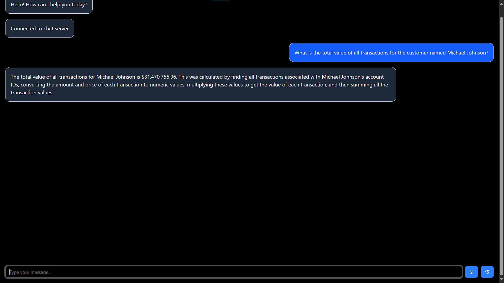
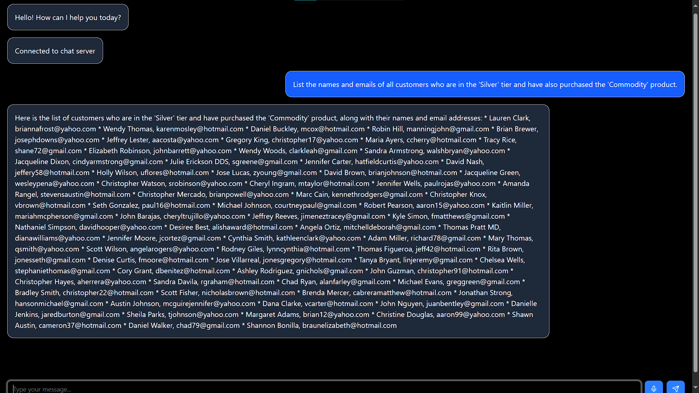
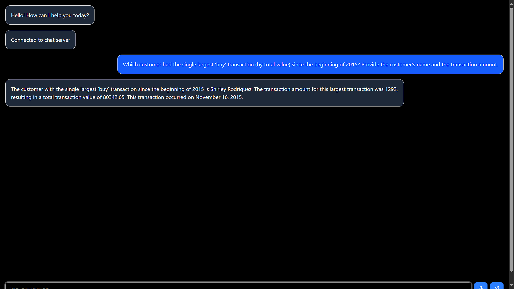
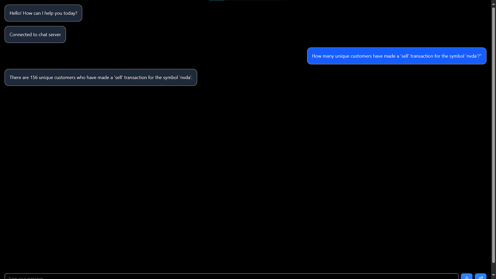

# Sylvr TakeHome assesment Chatbot

A modern chatbot application with voice input/output capabilities, built with Next.js, FastAPI, and MongoDB.

## Features

- Real-time chat interface with WebSocket connection
- Voice input with automatic transcription using Whisper
- Text-to-speech output using Google TTS
- MongoDB integration for data storage

## Prerequisites

- Python 3.11
- Node.js 18+ and npm
- MongoDB instance (local or cloud)

## Setup Instructions

### Backend Setup

1. Create and activate a Python virtual environment:
```bash
# Windows
python -m venv venv
.\venv\Scripts\activate

# Linux/Mac
python3 -m venv venv
source venv/bin/activate
```

2. Install Python dependencies:
```bash
pip install -r requirements.txt
```

3. Create a `.env` file in the root directory with your MongoDB connection string:
```
MONGODB_URL=your_mongodb_connection_string
GOOGLE_API_KEY=yourapikey
```

4. Start the backend server:
```bash
# Start the main FastAPI server with WebSocket support
uvicorn chatbot.main:app --host 0.0.0.0 --port 8000

# In a separate terminal, start the TTS server
uvicorn TTS:app --host 0.0.0.0 --port 8001 (not working right now)
```

### Frontend Setup

1. Navigate to the frontend directory:
```bash
cd frontend
```

2. Install dependencies:
```bash
npm install
```

3. Start the development server:
```bash
npm run dev
```

The frontend will be available at `http://localhost:3000`

## Project Structure

```
.
├── chatbot/             # Backend chatbot implementation
│   └── main.py         # Main FastAPI application with WebSocket
├── frontend/           # Next.js frontend application
│   ├── app/           # Next.js app directory
│   ├── components/    # React components
│   └── public/        # Static assets
├── TTS.py             # Text-to-speech and transcription service
├── requirements.txt   # Python dependencies
└── README.md         # This file
```

## Usage

1. Open the application in your browser at `http://localhost:3000`
2. Type messages in the input box or use the microphone button to record voice input
3. Click the speaker icon next to bot responses to hear them spoken aloud
4. The chat interface supports both text and voice interactions

## Development

- The frontend is built with Next.js and uses Tailwind CSS for styling
- The backend uses FastAPI for both REST API and WebSocket endpoints
- Voice transcription is handled by OpenAI's Whisper model
- Text-to-speech is implemented using Google's TTS service

## Notes

- Make sure both backend servers (main and TTS) are running for full functionality
- The microphone feature requires browser permissions
- For production deployment, update the CORS settings in TTS.py with your frontend URL

## Sample Questions

### 1


### 2


### 3


### 4


### 5


# Additional Notes About Current Implementation for the Reviewer

## Currently Implemented

I have implemented all of these components with **simple React components** (this is not my best suite, it's more of a quick UI) alongside **Google's agent development ecosystem**.

The ADK (Agent Development Kit) is a powerful option in this context. It lets the Large Language Model (LLM) decide when and if it should call a tool.  
Using **Gemini-2.0-Flash**, I noticed some potential irregularities while trying to solve a user's query in an agentic way — the model sometimes failed to produce answers **even though it's completely capable and the prompts explicitly tell it to use the tools provided**.  
This might be a limitation of the Gemini-2.0-Flash model itself; I haven't gotten a chance to test it with other models yet.  
Using `litellm` we can easily plug in different models and compare their behavior.  
I chose Gemini primarily because I had **free credits from a GDG workshop**.

---

## Speech-to-Text (STT)

The API endpoint for STT using **OpenAI Whisper** is already present in the code.  
I have previously gotten Whisper to work in Google Colab for various STT purposes, but I didn't integrate it here due to **confusion about how voice files would be routed through the API**.  
This can be addressed with proper file handling and a bit more API-side configuration.

---

## Text-to-Speech (TTS)

For now, TTS has been implemented with **gTTS**, which is not the best solution in terms of voice naturalness or control.  
Better alternatives exist — for example, **open-source models from Nari labs**.  
The **[DIA 1.6B TTS](https://huggingface.co/Nari-Labs/dia-1.6b) 
** model is a very impressive TTS that I previously tried on Hugging Face.  
This would be my ideal choice if we were to implement TTS in a more robust and scalable way.

---

## Summary

- **Current:**  
  - UI: React components  
  - Model: Gemini-2.0-Flash  
  - STT: Whisper (API endpoint present, not integrated)  
  - TTS: gTTS (quick solution)

- **Possible Improvement:**  
  - Integrate **DIA 1.6B TTS** from Nari labs for more natural voice output.  
  - Experiment with other models through **litellm**.  
  - Handle voice files gracefully to connect Whisper API.  

---

# Possible Approach to Implement World Model Dashboard

Originally, the pipeline consisted of 3 components which were called in sequence:

**Planner Agent:**
Determining the overall objective and framing a plan for retrieving information.

**Query Builder Agent:**
Translating the plan into a precise database query.

**Answerer Agent:**
Fetching the data, formulating the final answer, and adding it back into conversation context.

Improvement Ideas (If There Was More Time)
## 1. Integrate World Model into Planner
Originally, the planner only decided how to proceed with a query.
To implement a world model, I would:

Extract user intent alongside the plan.

Produce a structured output, adding a new key (e.g. extraction_objective) to reflect the true intent of the question.

For example:

```
json
{
  "plan": "Query transactions for total amount in Q1 2021",
  "extraction_objective": "Analyze total Q1 transactions to find spending trends"
}
```

This objective would be stored in state alongside the conversation context.

## 2. Database Gap and Sentiment Analysis in Answerer
Instead of adding separate components, we can reuse the Answerer to perform additional tasks:

Gap Analysis:
Identify if the database has gaps or missing information.

Sentiment Analysis:
Analyze the conversation’s tone and sentiment (confused, neutral, frustrated).

For example:

```
    json
    {
    "answer": "Here are total transactions for Q1 2021",
    "gap": "No transactions were found for Q1 2021",
    "sentiment": "neutral"
    }
```

## 3. Real-Time Storage to Database

Using the session ID, we can persist conversations to MongoDB in real time.
This lets us:

Keep a complete history of messages, plans, answers, gaps, and sentiment signals.

Query this data later for diagnostics and improvement (such as frequently confusing questions).

Summary
Instead of adding separate components or making additional API calls, we can:

Integrate the world model directly into the existing pipeline.

Produce enriched, structured output at each step.

Store these conversations in a datastore alongside Q&A.

This lets us perform powerful real-time and post-hoc analysis with minimal redundancy and effort.

If implemented, we can quickly build a World Model Dashboard — a view into:

User intent trends

Database gaps

Sentiment signals

Query patterns over time

This information can guide future improvements in both the knowledge base and the agent's capabilities.