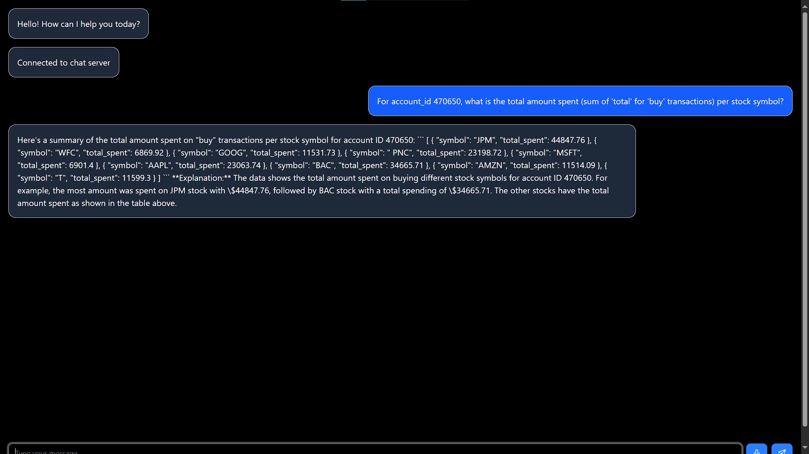

# Sylvr TakeHome assesment Chatbot

A modern chatbot application with voice input/output capabilities, built with Next.js, FastAPI, and MongoDB.

## Features

- Real-time chat interface with WebSocket connection
- Voice input with automatic transcription using Whisper
- Text-to-speech output using Google TTS
- MongoDB integration for data storage

## Prerequisites

- Python 3.11
- Node.js 18+ and npm
- MongoDB instance (local or cloud)

## Setup Instructions

### Backend Setup

1. Create and activate a Python virtual environment:
```bash
# Windows
python -m venv venv
.\venv\Scripts\activate

# Linux/Mac
python3 -m venv venv
source venv/bin/activate
```

2. Install Python dependencies:
```bash
pip install -r requirements.txt
```

3. Create a `.env` file in the root directory with your MongoDB connection string:
```
MONGODB_URL=your_mongodb_connection_string
```

4. Start the backend server:
```bash
# Start the main FastAPI server with WebSocket support
uvicorn chatbot.main:app --host 0.0.0.0 --port 8000

# In a separate terminal, start the TTS server
uvicorn TTS:app --host 0.0.0.0 --port 8001
```

### Frontend Setup

1. Navigate to the frontend directory:
```bash
cd frontend
```

2. Install dependencies:
```bash
npm install
```

3. Start the development server:
```bash
npm run dev
```

The frontend will be available at `http://localhost:3000`

## Project Structure

```
.
├── chatbot/             # Backend chatbot implementation
│   └── main.py         # Main FastAPI application with WebSocket
├── frontend/           # Next.js frontend application
│   ├── app/           # Next.js app directory
│   ├── components/    # React components
│   └── public/        # Static assets
├── TTS.py             # Text-to-speech and transcription service
├── requirements.txt   # Python dependencies
└── README.md         # This file
```

## Usage

1. Open the application in your browser at `http://localhost:3000`
2. Type messages in the input box or use the microphone button to record voice input
3. Click the speaker icon next to bot responses to hear them spoken aloud
4. The chat interface supports both text and voice interactions

## Development

- The frontend is built with Next.js and uses Tailwind CSS for styling
- The backend uses FastAPI for both REST API and WebSocket endpoints
- Voice transcription is handled by OpenAI's Whisper model
- Text-to-speech is implemented using Google's TTS service

## Notes

- Make sure both backend servers (main and TTS) are running for full functionality
- The microphone feature requires browser permissions
- For production deployment, update the CORS settings in TTS.py with your frontend URL

## Sample Questions

### 1


### 2


### 3


### 4


### 5

